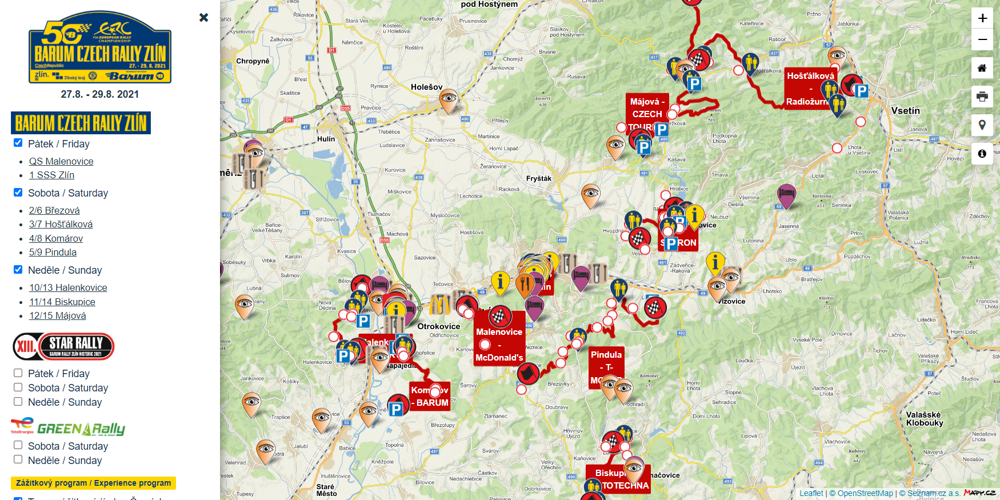

# Barum Czech Rally Zlin

---

Barum Czech Rally Zlin is a company which organizes a rally competition every year in a city Zlin, Czech Republic. Client wanted to provide fans a digital version of their maps. 

We worked in 2 persons team. My colleague in the role of project manager and me in the role of software developer. Client's employers didn't have a knowledge of React that time so we decided to use the simplest tools possible - jQuery with LeafletJS and plain HTML, CSS, JavaScript.  

My role included building the app from scratch, communication with the customer and with my colleague about new features. All data displayed in the map are stored locally in JSON files and loaded by amazing library LeafletJS.  

