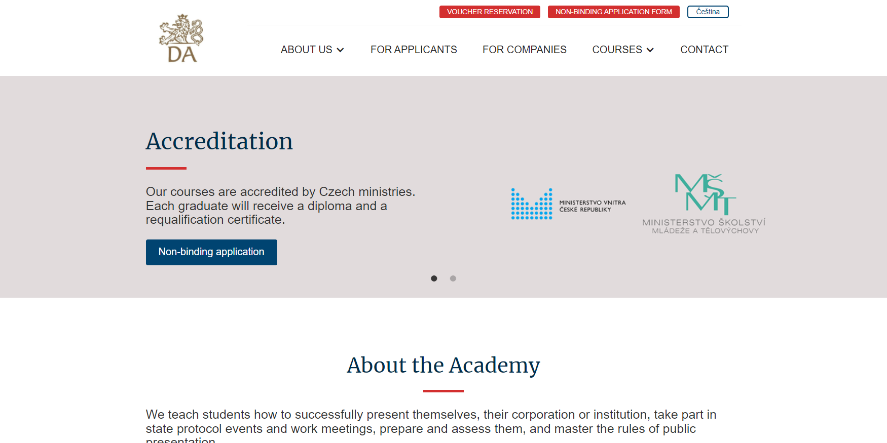

# Diplomatic Academy

---

Diplomatic Academy is a company providing accredited courses by Czech ministries on diplomacy. Client asked us to create a new fresh website with the good looking and professional design. In [KOALA42](https://koala42.com/en/) we decided to migrate the current website from [Drupal](https://www.drupal.org/) to the most popular CMS out there - [WordPress](https://wordpress.org/).

To save time and money the front-end was built using [Webflow](https://webflow.com/). After several weeks of designing the application in [Webflow](https://webflow.com/) I received the HTML & CSS output from colleagues. With that output I started building the WordPress theme from scratch. Final theme uses [Advanced Custom Fields (ACF)](https://www.advancedcustomfields.com/) & [custom post types](https://en-ca.wordpress.org/plugins/custom-post-type-ui/) for storing data about all teachers.  

During that process we have created a [wordpress-to-webflow plugin](https://github.com/Koala42/webflow-to-wordpress-menu) which can convert the Webflow menu to the wordpress menu for your. It is available for free of charge on GitHub. 

