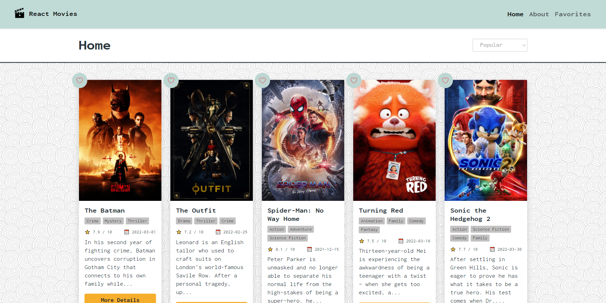

# React Movie App
---

Lorem ipsum dolor sit amet, consectetur adipiscing elit. Fusce quis enim at est pulvinar lacinia at vel enim. Duis porttitor, velit in viverra ultricies, nunc nisl semper leo, at hendrerit nibh odio vel sapien. Suspendisse sit amet scelerisque urna. Suspendisse potenti. Nunc porttitor maximus dignissim. Phasellus accumsan sollicitudin luctus. Vivamus vestibulum ipsum at ligula tristique, quis lobortis ex lobortis. Aliquam imperdiet, odio vel volutpat luctus, ante libero laoreet dui, quis imperdiet orci urna eget enim. Maecenas vulputate a metus eu suscipit.

Ut et purus faucibus, imperdiet tellus ut, pretium metus. Morbi ut ipsum faucibus, tempus odio at, mollis mi. Aliquam ex risus, tristique non orci nec, eleifend suscipit augue. Nunc sollicitudin sodales eros, quis efficitur ante faucibus vitae. Nam posuere dignissim neque at rutrum. Suspendisse potenti. Aenean venenatis malesuada ante, non sagittis nunc congue ac. Vestibulum sagittis posuere ex, id venenatis mi porta at. Cras tincidunt augue felis, eleifend sagittis mi posuere eget. Ut sodales quam ac dolor euismod, sit amet facilisis tortor elementum. Mauris in rhoncus dolor.

